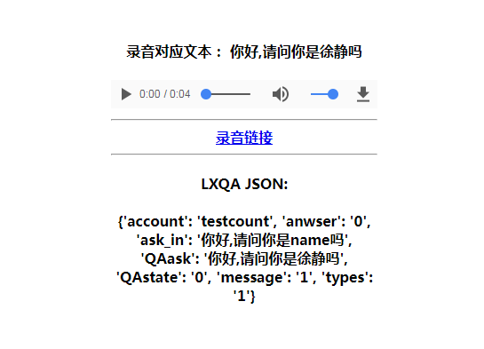
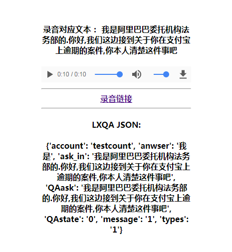

# 返回Audio的API {#audio-api}

我们除了提供了JSON字符串格式的API之外，还提供了音频返回的REST API，该API接口除了返回标准的JSON字符串之外，还额外的返回了，当前自呼机器人聊天的语音文本(语音格式是.mp3),基于GET请求中types参数的变化(1types=1:温暖女法务版，types=2:专业男法务版;types=3:专业男法务磁性版), 类似于百度云语音中的TTS REST API接口支持语音的在线试听和下载。目前该API接口仅支持GET请求。


**GET请求的格式**
--------------------------

```
http://ip:port/lxqa/api/v1.0/audio/types=<types>&answer=<answer>&ask_pre=<ask_pre>
        &name=<name>&money=<money>&date=<date>&account=<account>/
#注意与JSON API的区别
```

+ ip：ip地址，具体的联信商务咨询有限公司会提供

+ port： 端口号，具体的联信商务咨询有限公司会提供

+ types： 发声人，目前我们提供了三个发声人types=1:温暖女法务版，types=2:专业男法务版;types=3:专业男法务磁性版

+ answer： 上一轮债务人的反应对应的文本

+ ask_pre：上一轮联信自呼机器人的话术模板

+ name： 债务人的姓名

+ identity: 债务人身份确认，可能性的取值有：0(当前无法判断),本人，其他联系人，异主

+ money：债务人对应的委案金额

+ date：接单时间

+ account：账户


**举个栗子：**
--------------------------------

Example1:开始拨打电话，此时并没有answer和ask_pre字段，此时需用“0”填补这两个字段，此时的URL为：

```
http://ip:port/lxqa/api/v1.0/audio/types=1&answer=0&ask_pre=0&
      name=徐静&money=100.1&date=2018-01-01&account=testcount/
```

+ types=1:调用温暖女法务版机器人

+ answer=0和ask_pre=0: 因是第一轮对话，没有answer和ask_pre因此传入参数"0"

+ name=徐静：债务人的姓名叫徐静

+ money=100.1:债务人的欠款金额是100.1

+ date=2018-01-01: 债务人的案件的接单时间是2018年01月01日(注意该格式可以是任意类型的时间字符串)

+ account=testcount: 债务人对应的系统账户为testcount

此时GET请求将会返回如下的JSON字符串


```{r echo=FALSE,fig.align = 'center',out.width='150%',out.height='150%'}

```

录音对应文本：当前自呼机器人的返回内容

录音链接：下载录音的地址

LXQA JSON 同第二章相同：

+ QAask: 当前自呼机器人的表述

+ QAstate: 当前自呼机器人的是否挂断的判断："0"表示不挂断，"1"表示挂断，结束通话

+ account: 债务人的账户

+ answer: 债务人上一轮的表述

+ ask_in: 当前聊天机器人的话术模板，作为下一轮调用自呼机器人的ask_pre参数取值（GET请求时，ask_pre字段应该提交聊天机器人的话术）

+ message: API调用的状态，"0"表示调用API异常，"1"表示调用API正常

+ types: 返回聊天机器人对用的音频文件

+ identity: 债务人身份确认，可能性的取值有：0(当前无法判断),本人，其他联系人，异主

Example2：聊天过程中的调用，此时存在answer和ask_pre字段，此时需用传入真实的字段文本内容，此时的URL为：

```
http://ip:port/lxqa/api/v1.0/audio/types=1&answer=不是啊&
  ask_pre=你好,请问你是name吗&money=100.1&date=2018-01-01&account=textcount/
```

```{r echo=FALSE,fig.align = 'center',out.width='150%',out.height='150%'}

```

返回的JSON字段意义同Example1中，但要注意，在过程中GET请求的数据一定要填写answer和ask_pre字段，并且ask_pre字段的是聊天机器人的话术模板，而非真正的ask字段。


**调用方式**
----------------------

可以通过Java,Python,R语言等工具，通过GET请求访问并实时获取API的数据。
